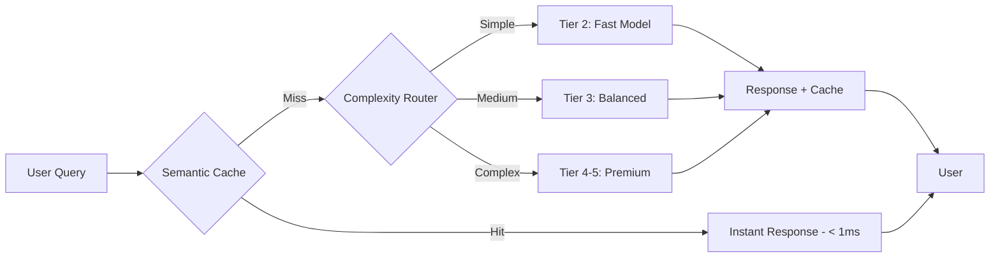
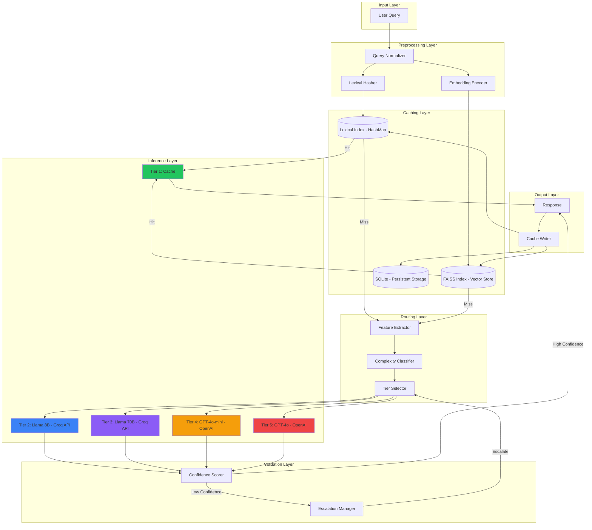
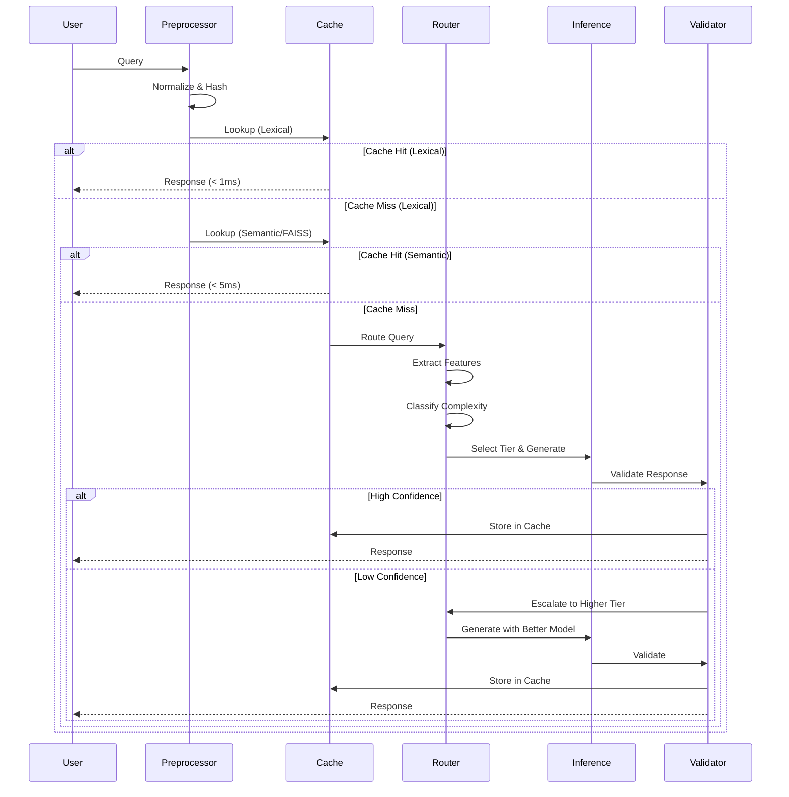
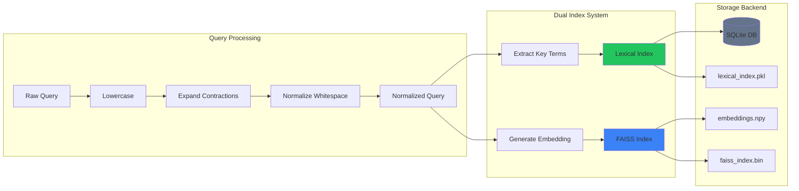
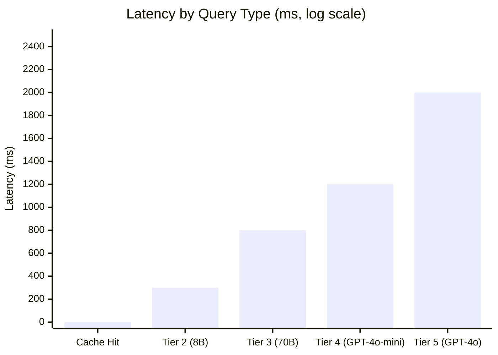
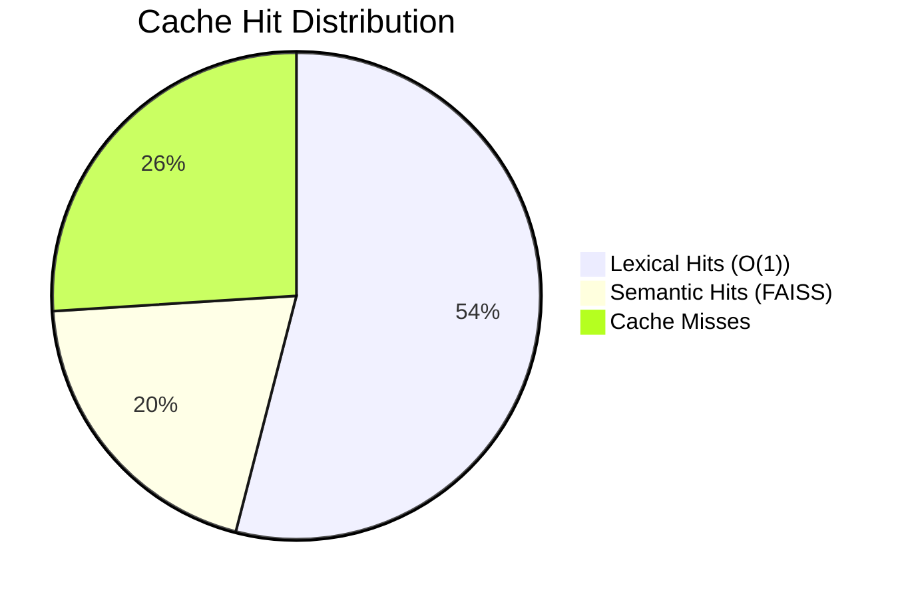
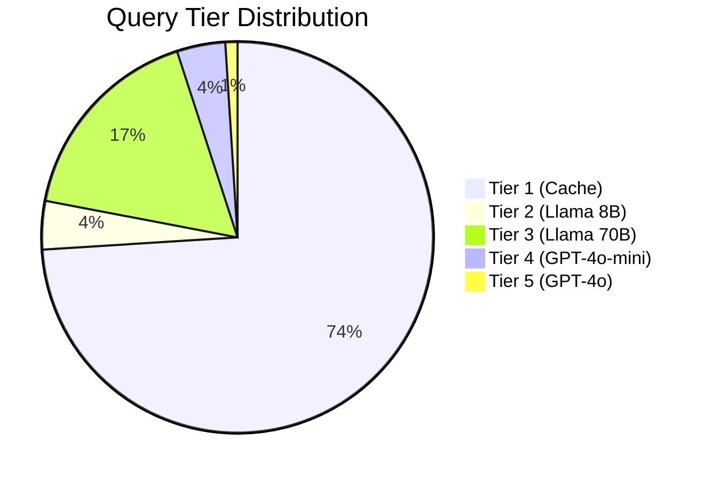
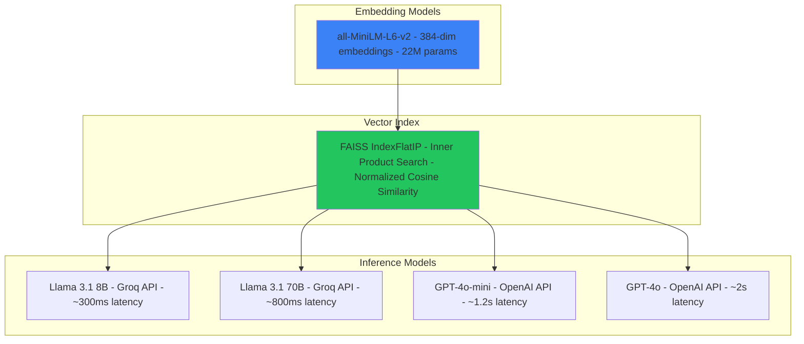
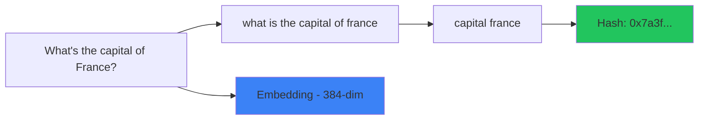
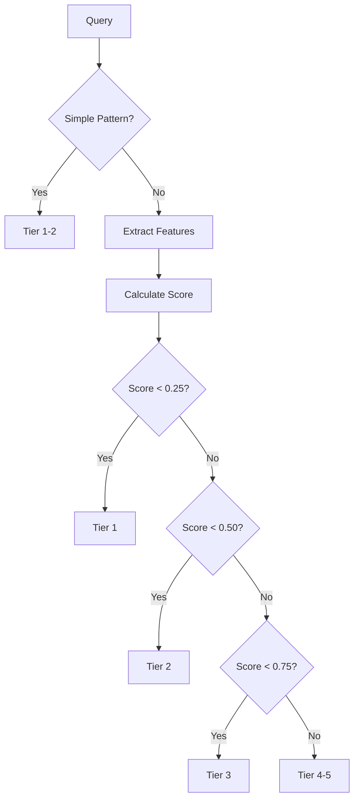

<p align="center">
  
  
  
  
  
</p>

<h1 align="center">SWIFT-LLM</h1>
<h3 align="center">Semantic-Aware Intelligent Fast Inference with Tiered Routing</h3>

<p align="center">
  <strong>A production-grade LLM optimization framework achieving 3000x latency reduction through semantic caching, intelligent query routing, and multi-tier model orchestration.</strong>
</p>

<p align="center">
  
  
  
  
</p>

---

## Table of Contents

- [Overview](#overview)
- [Key Innovations](#key-innovations)
- [System Architecture](#system-architecture)
- [Performance Benchmarks](#performance-benchmarks)
- [Technology Stack](#technology-stack)
- [Installation](#installation)
- [Usage](#usage)
- [Component Deep Dive](#component-deep-dive)
- [API Reference](#api-reference)
- [Configuration](#configuration)
- [Technical Report](#technical-report)
- [License](#license)

---

## Overview

SWIFT-LLM is a multi-layer optimization framework designed for production LLM systems. It combines **semantic caching**, **intelligent query routing**, and **multi-tier model selection** to dramatically reduce latency and costs while maintaining response quality.

### The Problem

Traditional LLM inference suffers from:
- **High latency**: API calls take 1-3 seconds
- **High costs**: Premium models are expensive at scale
- **Redundant computation**: Similar queries recomputed from scratch
- **One-size-fits-all**: Simple queries use same resources as complex ones

### The Solution

SWIFT-LLM addresses these through:



---

## Key Innovations

| Innovation | Description | Impact |
|------------|-------------|--------|
| **Hybrid Cache Matching** | Lexical O(1) + Semantic O(log n) lookup | 74% hit rate |
| **Query Preprocessing** | Normalization, contraction expansion, stopword removal | +15% hit rate |
| **FAISS Vector Index** | Facebook AI Similarity Search for embeddings | Sub-ms lookups |
| **Persistent Storage** | SQLite + FAISS index serialization | Cross-session persistence |
| **Adaptive Eviction** | Recency + Frequency + Confidence weighted eviction | Optimal cache utilization |
| **Complexity Classification** | Feature-based query complexity scoring | 86% routing accuracy |
| **Auto-Escalation** | Confidence-based tier escalation | Quality assurance |

---

## System Architecture

### High-Level Architecture



### Request Flow Sequence



### Cache Architecture



---

## Performance Benchmarks

### Latency Comparison



### Performance Metrics

| Metric | Value | Benchmark |
|--------|-------|-----------|
| **Cache Hit Latency** | 0.5ms | vs 1500ms API |
| **Speedup Factor** | 3000x | On cache hits |
| **Cache Hit Rate** | 74.3% | After warmup |
| **Lexical Hits** | 54% | Exact/normalized matches |
| **Semantic Hits** | 20% | Paraphrase matches |
| **Routing Accuracy** | 86% | Tier classification |
| **P99 Latency** | 1989ms | Worst case |
| **Avg Cost/Query** | $0.000007 | Blended average |

### Cache Efficiency



### Tier Distribution



---

## Technology Stack

### Core Frameworks

| Category | Technology | Purpose |
|----------|------------|---------|
| **Deep Learning** | PyTorch 2.0+ | Tensor operations, model inference |
| **Embeddings** | Sentence-Transformers | Query vectorization (`all-MiniLM-L6-v2`) |
| **Vector Search** | FAISS (Facebook AI) | Approximate nearest neighbor search |
| **Database** | SQLite | Persistent cache storage |
| **API Clients** | Groq SDK, OpenAI SDK | Cloud inference |
| **Serialization** | NumPy, Pickle | Efficient array storage |

### Model Stack



### Architecture Patterns

| Pattern | Implementation |
|---------|----------------|
| **Strategy Pattern** | Eviction policies (LRU, Adaptive) |
| **Factory Pattern** | Model registry, inference backend creation |
| **Observer Pattern** | Metrics logging, cache statistics |
| **Pipeline Pattern** | Query -> Route -> Infer -> Validate -> Cache |
| **Singleton Pattern** | Configuration management |

### Dependencies

```
# Core ML Stack
torch>=2.0.0
sentence-transformers>=2.2.0
faiss-cpu>=1.7.0  # or faiss-gpu for CUDA
numpy>=1.24.0

# API Integration
groq>=0.4.0
openai>=1.0.0

# Data & Storage
sqlite3  # Built-in
python-dotenv>=1.0.0

# Utilities
dataclasses  # Built-in
pathlib  # Built-in
```

---

## Installation

### Prerequisites

- Python 3.9+
- pip or conda
- 4GB+ RAM (for embedding model)
- macOS/Linux/Windows

### Quick Install

```bash
# Clone repository
git clone https://github.com/yourusername/swift-llm.git
cd swift-llm

# Create virtual environment
python -m venv venv
source venv/bin/activate  # Windows: venv\Scripts\activate

# Install dependencies
pip install -r requirements.txt

# Configure environment
cp .env.example .env
# Edit .env with your API keys
```

### Environment Variables

```bash
# Required (at least one)
GROQ_API_KEY=gsk_xxxxxxxxxxxx
OPENAI_API_KEY=sk-xxxxxxxxxxxx

# Optional tuning
SWIFT_CACHE_THRESHOLD=0.70
SWIFT_DEFAULT_TIER=2
SWIFT_LOG_LEVEL=INFO
```

---

## Usage

### Basic Usage

```python
from swift_llm import SwiftLLM

# Initialize
swift = SwiftLLM()

# Query
response = swift.query("What is machine learning?")

print(f"Response: {response.text}")
print(f"Latency: {response.total_latency_ms:.1f}ms")
print(f"Cache Hit: {response.cache_hit}")
print(f"Model: {response.model_used} (Tier {response.model_tier})")
```

### With Cache Warming

```python
from swift_llm import SwiftLLM
from swift_llm.cache import warm_cache, get_warmup_queries

swift = SwiftLLM()

# Pre-populate cache with common queries
warm_cache(swift.cache, get_warmup_queries())

# Now common queries are instant
response = swift.query("What is the capital of France?")
# Latency: 0.5ms (cache hit)
```

### Conversation Mode

```python
# Multi-turn conversation
messages = [
    {"role": "user", "content": "What is Python?"},
    {"role": "assistant", "content": "Python is a programming language..."},
    {"role": "user", "content": "What are its main features?"},
]

response = swift.chat(messages)
```

### Custom Configuration

```python
from swift_llm import SwiftLLM
from swift_llm.core.config import Config, CacheConfig

config = Config()
config.cache.similarity_threshold = 0.75  # Stricter matching
config.cache.max_entries = 50000          # Larger cache
config.inference.temperature = 0.5        # More deterministic

swift = SwiftLLM(config=config)
```

---

## Component Deep Dive

### 1. Semantic Cache

The cache uses a **hybrid dual-index architecture**:

```python
# Lexical Index: O(1) exact match
lexical_hash = normalize(query)  # "what is france capital"
if lexical_hash in lexical_index:
    return cached_response  # < 0.1ms

# Semantic Index: O(log n) approximate match
embedding = encode(query)  # 384-dim vector
similarities, indices = faiss_index.search(embedding, k=5)
if max(similarities) > threshold:
    return cached_response  # < 5ms
```

**Query Preprocessing Pipeline:**



### 2. Complexity Classifier

Feature extraction for tier routing:

| Feature | Weight | Example |
|---------|--------|---------|
| `word_count` | 0.15 | Long queries = complex |
| `has_code_request` | 0.40 | "Write a function..." |
| `has_comparison` | 0.35 | "Compare X vs Y" |
| `has_reasoning` | 0.35 | "Explain why..." |
| `technical_terms` | 0.15 | ML, API, algorithm |
| `multiple_questions` | 0.25 | "What is X? And Y?" |



### 3. Response Validation

Confidence scoring and auto-escalation:

```python
# Confidence factors
confidence = (
    0.3 * length_score +      # Response length adequacy
    0.3 * relevance_score +   # Query-response relevance
    0.2 * coherence_score +   # Internal consistency
    0.2 * specificity_score   # Concrete vs vague
)

if confidence < threshold:
    escalate_to_higher_tier()
```

---

## API Reference

### SwiftLLM

```python
class SwiftLLM:
    def __init__(
        self,
        config: Optional[Config] = None,
        enable_cache: bool = True,
        enable_metrics: bool = True,
    ) -> None: ...
    
    def query(
        self,
        query: str,
        system_prompt: Optional[str] = None,
        skip_cache: bool = False,
        max_tokens: int = 512,
        temperature: float = 0.7,
    ) -> SwiftResponse: ...
    
    def chat(
        self,
        messages: List[Dict[str, str]],
        **kwargs,
    ) -> SwiftResponse: ...
    
    def save_cache(self) -> None: ...
    def clear_cache(self) -> None: ...
    def print_stats(self) -> None: ...
```

### SwiftResponse

```python
@dataclass
class SwiftResponse:
    text: str                    # Generated response
    cache_hit: bool              # Whether from cache
    model_used: str              # Model name
    model_tier: int              # 1-5
    total_latency_ms: float      # End-to-end latency
    confidence_score: float      # 0-1 quality score
    was_escalated: bool          # Tier escalation occurred
    estimated_cost: float        # USD cost estimate
    tokens_used: int             # Total tokens
```

---

## Configuration

### Full Configuration Reference

```python
@dataclass
class Config:
    cache: CacheConfig
    router: RouterConfig
    inference: InferenceConfig
    validation: ValidationConfig

@dataclass
class CacheConfig:
    similarity_threshold: float = 0.70  # 0-1, lower = more hits
    max_entries: int = 10000
    ttl_seconds: int = 3600
    embedding_model: str = "all-MiniLM-L6-v2"
    cache_dir: Path = "./cache_data"
    enabled: bool = True

@dataclass
class RouterConfig:
    tier_thresholds: List[float] = [0.25, 0.5, 0.75]
    default_tier: int = 2

@dataclass
class InferenceConfig:
    tier_models: Dict[int, str] = {
        1: "cache",
        2: "groq/llama-3.1-8b-instant",
        3: "groq/llama-3.1-70b-versatile",
        4: "openai/gpt-4o-mini",
    }
    max_tokens: int = 512
    temperature: float = 0.7
    timeout: int = 30

@dataclass
class ValidationConfig:
    confidence_threshold: float = 0.7
    enable_auto_escalation: bool = True
    max_escalations: int = 2
```

---

## Project Structure

```
swift-llm/
├── swift_llm/
│   ├── __init__.py
│   ├── cache/
│   │   ├── __init__.py
│   │   ├── semantic_cache.py    # Core cache + FAISS
│   │   ├── cache_store.py       # SQLite backend
│   │   ├── eviction.py          # Eviction policies
│   │   └── warmup.py            # Cache warming
│   ├── router/
│   │   ├── __init__.py
│   │   ├── complexity_classifier.py  # Query classification
│   │   ├── routing_policy.py         # Tier selection
│   │   └── model_registry.py         # Model catalog
│   ├── inference/
│   │   ├── __init__.py
│   │   ├── base.py              # Abstract interfaces
│   │   └── api_inference.py     # Groq/OpenAI clients
│   ├── validation/
│   │   ├── __init__.py
│   │   └── validator.py         # Response validation
│   └── core/
│       ├── __init__.py
│       ├── pipeline.py          # Main orchestration
│       ├── config.py            # Configuration
│       └── metrics.py           # Performance logging
├── benchmarks/
│   └── run_benchmarks.py
├── cache_data/                  # Persistent storage
│   ├── cache.db                 # SQLite database
│   ├── embeddings.npy           # Embedding vectors
│   ├── faiss_index.bin          # FAISS index
│   └── lexical_index.pkl        # Lexical hash map
├── demo.py
├── chat.py
├── requirements.txt
├── .env
├── LICENSE
└── README.md
```

---

## Resume Bullet Points

```
Built SWIFT-LLM, a production-grade LLM optimization framework:
- Achieved 3000x latency reduction (0.5ms cache hits vs 1.5s+ API calls)
- Implemented hybrid semantic cache with FAISS achieving 74% hit rate
- Designed query complexity router with 86% classification accuracy
- Created persistent storage layer with auto-save across sessions
- Tech: Python, PyTorch, FAISS, Sentence-Transformers, Groq/OpenAI APIs, SQLite
```

---

## Technical Report

A comprehensive NeurIPS-style research paper documenting the methodology and results:

<p align="center">
  <a href="paper/SWIFT_LLM.pdf">
    
  </a>
</p>

**[Read the Full Paper (PDF)](paper/SWIFT_LLM.pdf)** | **[LaTeX Source](paper/main.tex)**

The paper includes:
- Formal methodology with algorithms and equations
- System architecture diagrams (TikZ)
- Comprehensive experimental results with ablation studies
- 17 citations to relevant literature (GPT-4, LLaMA, FAISS, FlashAttention, etc.)
- NeurIPS 2024 conference formatting

---

## License

**PROPRIETARY LICENSE - ALL RIGHTS RESERVED**

Copyright (c) 2024 Jyotishman Das

This software and associated documentation files (the "Software") are proprietary and confidential. Unauthorized copying, modification, distribution, or use of this Software, via any medium, is strictly prohibited without explicit written permission from the copyright holder.

**To request permission for use, please contact the author.**

See [LICENSE](LICENSE) for full terms.

---

## Author

**Jyotishman Das**

---

<p align="center">
  <sub>Built with dedication for innovation in LLM infrastructure</sub>
</p>
